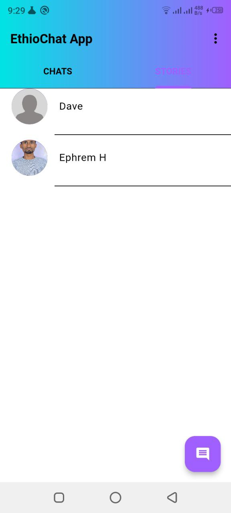

# EthioChat App

## Overview

EthioChat is a mobile application built to facilitate communication among users with Ethiopian heritage. It provides a platform for individuals to connect, chat, and share experiences within the Ethiopian community.

## Technologies Used

* Flutter: Google's UI toolkit for fast, expressive app development across mobile, web, and desktop platforms.
* Firebase: Google's platform for mobile and web apps, providing real-time database, authentication, and more. Used in EthioChat for authentication, messaging, and data storage.
* RiverPod: A Flutter state management library based on provider, facilitating robust state management for complex UI interactions and data flow.

## Features

* Phone Authentication: Users can securely sign up and log in using their phone numbers.
* Chat: Engage in real-time one-on-one or group conversations, sharing text, images, videos, emojis, and voice messages.
* Group Chat: Participate in group conversations with multiple users simultaneously.
* Stories: Share ephemeral updates with images, videos, or text, providing a dynamic way to share moments with contacts.

## Getting Started

1. Clone the repository:
```bash
git clone https://github.com/Bit-SWE-4th-G7/EthioChat-App.git
```
2. Install dependencies:

```bash
flutter pub get
```
3. Setting up Firebase

* Go to the Firebase Console.
* Click "Add project" and follow the prompts to create a new project.
* Enable "Phone Authentication" under "Authentication" in the left sidebar.
* Set up a Firestore Database by clicking "Firestore Database" and following the    prompts. Ensure to set appropriate security rules.
* Download the Firebase configuration files (google-services.json for Android or GoogleService-Info.plist for iOS) and replace the corresponding files in the project directory.
4 Run the app on an emulator or a physical device using Flutter CLI commands or your preferred IDE. Use the following command to run the app:

```bash
flutter run
```

## Learning Journey
The development of EthioChat represents a journey of skill acquisition and application. The team mastered Flutter, RiverPod for state management, and Firebase for real-time communication and data storage. This involved learning various aspects of UI/UX design, backend development, and integrating Firebase services to ensure seamless functionality.

## Timeline

EthioChat's development cycle was remarkably swift, culminating in a fully functional app within a mere one month.

## Security

EthioChat prioritizes user data safety through stringent security measures, particularly in its robust user authentication system.

## Contributors

### Group 7 Members

- Dawit Zewdu
- Ephrem Habtamu
- Fentahun Mengie
- Jemal Workie
- Solomon Muhye
- Yikeber Misganaw

### Screenshots


*Home Page*


*person chat*


*Group chat*


*Create Group*


##### Copyright &copy; 2024
